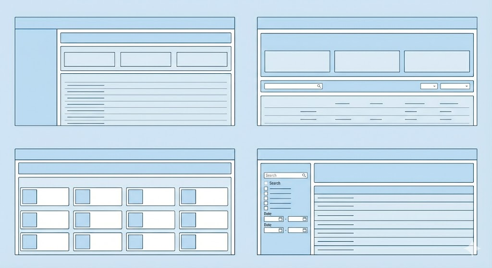

## Table of Contents

- [FRONTEND TECHNICAL ASSESSMENT 🏌️‍♂️](#frontend-technical-assessment-️️)
  - [Part 1. Develop a small app](#part-1-develop-a-small-app)
    - [**Option A: SpaceX Mission Control 🚀**](#option-a-spacex-mission-control-)
      - [Core Requirements:](#core-requirements)
    - [**Option B: Crypto Market Analyzer 📈**](#option-b-crypto-market-analyzer-)
      - [Core Requirements:](#core-requirements-1)
  - [Technical Specifications \& Constraints](#technical-specifications--constraints)
  - [Part 2. Documentation \& Process](#part-2-documentation--process)
    - [1. The Architecture \& Tech Stack:](#1-the-architecture--tech-stack)
    - [2. AI Usage (Transparency):](#2-ai-usage-transparency)
    - [3. Design Decisions:](#3-design-decisions)
    - [4. Challenges \& Trade-offs:](#4-challenges--trade-offs)
  - [🔍 How we evaluate](#-how-we-evaluate)
  - [✅ How to Submit](#-how-to-submit)

---

# FRONTEND TECHNICAL ASSESSMENT 🏌️‍♂️

Welcome to the Finsphera Frontend Technical Assessment. This is a challenge to evaluate your skills as a frontend developer. The assessment is structured to give you the freedom to show your skills and creativity as a developer 🧠

The challenge is divided into two parts:

1. The Build: creating a polished web application.
2. The Process: documenting your journey and tool usage.

## Part 1. Develop a small app

As part of the challenge, you will need to build a web application choosing ONE of the following options.

### **Option A: SpaceX Mission Control 🚀**

A dashboard / control panel to visualize the history of SpaceX Rocket Launches. The idea is to use the free and open [Space-X API](https://github.com/r-spacex/SpaceX-API).

We are not looking for a simple list; We want an UI/UX that allows you to explore and visualize a clean, responsive and modern interface that shows information cleanly.

#### Core Requirements:

- Fetch the list of launches from the public SpaceX API
- Show loading, error, and empty states.
- Clicking an item shows a details panel or modal (video, description, launch site, etc.).
- Responsive layout (sidebar + main panel).
- TypeScript and clear component structure.

### **Option B: Crypto Market Analyzer 📈**

A web application to track and analyze market-data using the [Binance Free API](https://developers.binance.com/docs/binance-spot-api-docs/faqs/market_data_only). The interface should display a list of crypto or FX prices from a public API or the API that we are suggesting.

We are not looking for a simple list; We want an UI/UX that allows you to explore and visualize a clean, responsive and modern interface that shows information cleanly.

#### Core Requirements:

- Fetch list of items (e.g., crypto prices) from API.
- Show loading, error, and empty states.
- Implement a search bar (filter by name/symbol).
- Clicking an item shows a details panel or modal (price history, description, etc.).
- Responsive layout (sidebar + main panel).
- TypeScript + component structure.

---

## Technical Specifications & Constraints

To mimic our daily workflow at Finsphera, please adhere to the following:

1.  Framework:

    - Preferred: Next.js (App Router).
    - Acceptable: React + Vite.

2.  Styling:

    - Required: Tailwind CSS.
    - Bonus: Use Framer Motion for smooth transitions and interactions.

3.  Language:

    - Required: TypeScript (Strict mode preferred. Avoid any).

4.  Design Freedom:

    We are not providing a Figma file. You are the designer.
    We have provided a few layout concepts in the image below (Layout_Examples.png) to spark your imagination, but feel free to innovate.

         Focus on: Visual Hierarchy, Spacing (Whitespace), and Typography.

    

5.  Deployment:

    Deploy your project to a free hosting platform (we recommend Vercel or Netlify for the easiest Next.js integration).

    - Mandatory: We need the Live URL to test the UX immediately.
    - Mandatory: We need the Public Repo URL to review the code.

---

## Part 2. Documentation & Process

We believe that the journey is just as important as the destination. We want to understand the human behind the code: how you think, how you solve problems, and how you leverage modern tools to be efficient.

Please update the `README.md` file in your repository to include a summary of your process. This is your space to "sell" your technical decisions.

What we want to see in your documentation:

### 1. The Architecture & Tech Stack:

Briefly explain your folder structure and why you organized it that way. Why did you choose specific libraries? (e.g., Why did you choose that specific state management tool? Why that fetching library?).

### 2. AI Usage (Transparency):

At Finsphera, we embrace AI as a tool for efficiency. If you used tools like ChatGPT, Claude, GitHub Copilot, or Cursor, tell us how. Did you use it to generate the TypeScript interfaces? To debug a specific error? To brainstorm the layout? We value the ability to prompt effectively and review AI output.

### 3. Design Decisions:

Why did you choose that specific layout? How did you approach the UX for the "Details" view?

### 4. Challenges & Trade-offs:

Did you hit a roadblock with the API? How did you solve it? If you had more time, what would you improve or refactor?

> Format: There is no strict template. Feel free to use diagrams, screenshots, or simple text.

---

## 🔍 How we evaluate

We are not looking for "perfect" code, we are looking for thoughtful code.

- UI/UX Polish: Does it look professional? Are the interactions smooth?
- Code Quality: Is the code modular, reusable, and typed correctly?
- Resilience: Does the app break if the API fails?
- Creativity: Did you add a "wow" factor? (e.g., Dark Mode, Animations, innovative layout).

Happy Coding! 🚀

## ✅ How to Submit

When you are ready to share your work, please ensure you provide both links:

1. The Source Code: A link to your public GitHub (or GitLab/Bitbucket) repository.
2. The Live Demo: A link to the deployed application (e.g., Vercel, Netlify, Railway).

To submit: Reply to the email that sent you this challenge with both links,
